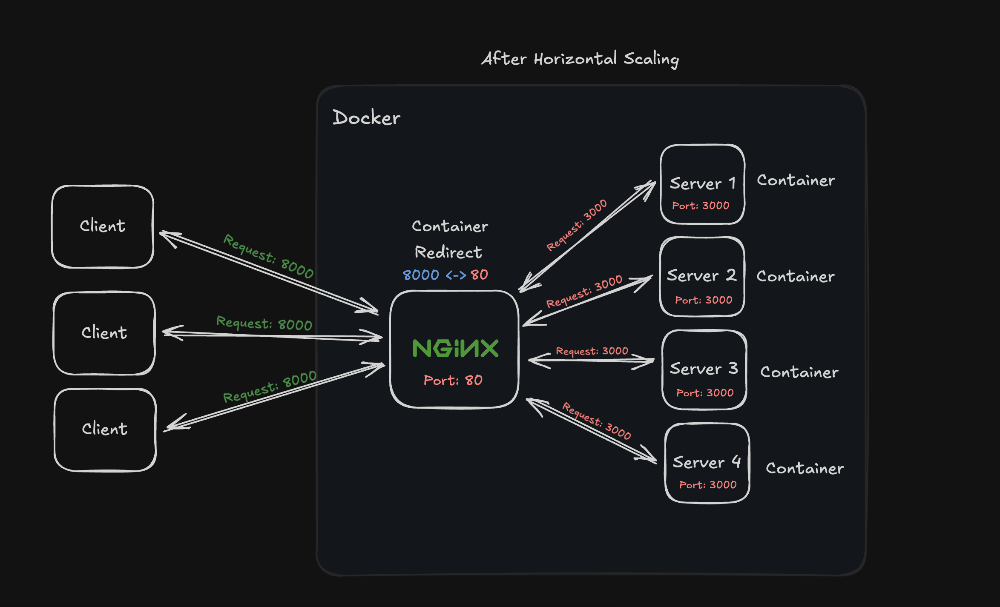

<div align="center">

## <a name="header">Horizontal Scaling</a>

  <div>
    
    
    
    
  </div>
</div>



## 📌 <a name="summary">Summary</a>

1. ⚙️ [Tech Stack](#tech-stack)
1. 🔧 [Ferramentas](#wrench)
1. ©️ [Snippets (Code to Copy)](#snippets)

<br />

## <a name="tech-stack">⚙️ Tech Stack</a>

* Typescript
* Hono
* Bun
* Docker
* Nginx

<br />


## <a name="wrench">🔧 Tools</a>

**Pré Requisitos**
* [Bun](https://bun.sh/docs/installation)
* [Hono](https://hono.dev/docs/guides)
* [Docker](https://www.docker.com/products/docker-desktop/)

**Apps**

* [VSCode](https://code.visualstudio.com/)
* [Bruno API Client](https://www.usebruno.com/)

**VSCode Extensions**

* NGINX Configuration: `william-voyek.vscode-nginx`
* Docker: `ms-azuretools.vscode-docker`

**Snippet de Instalação -  VSCode Extensions**

```sh
code --install-extension william-voyek.vscode-nginx
code --install-extension ms-azuretools.vscode-docker
```
<br />
